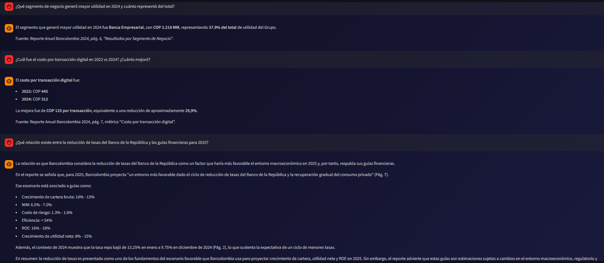

# mi-rag | Document Intelligence Platform

Sistema RAG (Retrieval-Augmented Generation) para ingestión y búsqueda semántica de documentos empresariales en PDF.

## Demo

### Chat con Documentos



*Chat conversacional respondiendo preguntas sobre el Reporte Anual de Bancolombia 2024*

### Badges


## Características

- **Ingesta de PDFs** — Extracción de texto y tablas con pdfplumber
- **Chunking inteligente** — 512 tokens con overlap de 64, tablas como chunk completo
- **Embeddings semánticos** — perplexity/pplx-embed-v1-0.6b (1024 dims, gratis)
- **LLM para respuestas** — nex-agi/nex-n2-pro:free (gratis)
- **Almacenamiento vectorial** — Qdrant cloud
- **Interfaz web moderna** — Chat conversacional con documentos
- **61 tests unitarios** — pytest con mocks

## Arquitectura

```
PDF → Extracción → Chunking → Embeddings → Qdrant
                                                ↓
                                          Búsqueda semántica
                                                ↓
                                          LLM genera respuesta
```

## Stack Tecnológico

| Componente | Tecnología | Costo |
|------------|-----------|-------|
| Lenguaje | Python 3.11+ | Gratis |
| PDF | pdfplumber | Gratis |
| Tokens | tiktoken | Gratis |
| Embeddings | perplexity/pplx-embed-v1-0.6b | Gratis |
| LLM | nex-agi/nex-n2-pro:free | Gratis |
| Vector DB | Qdrant Cloud | Gratis |
| UI | Streamlit | Gratis |

**Costo total: $0** — Todos los modelos son gratuitos vía OpenRouter.

## Instalación

```bash
# Clonar
git clone https://github.com/tu-usuario/mi-rag.git
cd mi-rag

# Crear entorno virtual
python -m venv .venv
.venv\Scripts\activate  # Windows
# source .venv/bin/activate  # Linux/Mac

# Instalar dependencias
pip install -r requirements.txt
```

## Configuración

Crea un archivo `.env` en la raíz:

```bash
OPENROUTER_API_KEY=sk-or-v1-tu-api-key
QDRANT_URL=https://tu-instancia-qdrant.com:443
QDRANT_API_KEY=tu-api-key-qdrant
```

Obtén tu API key gratuita en:
- **OpenRouter**: https://openrouter.ai/keys
- **Qdrant**: https://cloud.qdrant.io/

## Uso

### Interfaz Web

```bash
streamlit run scripts/app.py
```

Se abre en `http://localhost:8501`

### CLI — Ingesta

```bash
python scripts/ingest.py --pdf documento.pdf --empresa "ACME" --año 2024
```

### CLI — Búsqueda

```bash
# Solo buscar (sin LLM)
python scripts/query.py --query "¿Cuáles fueron los ingresos?" --no-answer

# Buscar + respuesta del LLM
python scripts/query.py --query "¿Cuáles fueron los ingresos?" --empresa "ACME"
```

### Tests

```bash
pytest tests/ -v
```

## PDF de Ejemplo

Incluyo un PDF de prueba para que puedas probar el sistema sin crear tu propio documento:

- **`assets/Reporte_Anual_Bancolombia_2024.pdf`** — Reporte anual real para testing

```bash
# Probar con el PDF de ejemplo
python scripts/ingest.py --pdf assets/Reporte_Anual_Bancolombia_2024.pdf --empresa "Bancolombia" --año 2024
```

## Estructura del Proyecto

```
mi-rag/
├── .env                  # Configuración (no subir a git)
├── .gitignore
├── requirements.txt
├── assets/
│   ├── chat-demo.png                    # Screenshot del chat
│   └── Reporte_Anual_Bancolombia_2024.pdf  # PDF de ejemplo
├── scripts/
│   ├── ingest.py         # Pipeline de ingestión
│   ├── query.py          # Búsqueda + LLM
│   └── app.py            # Interfaz web Streamlit
├── tests/
│   ├── conftest.py       # Fixtures
│   ├── test_chunking.py  # Tests de chunking
│   ├── test_tables.py    # Tests de tablas
│   ├── test_extraction.py # Tests de extracción PDF
│   ├── test_embeddings.py # Tests de embeddings
│   ├── test_qdrant.py    # Tests de Qdrant
│   └── test_file_hash.py # Tests de hash
├── docs/
│   ├── architecture.md   # Documentación técnica
│   ├── PRD.md            # Requerimientos del producto
│   ├── DOD.md            # Definition of Done
│   └── handoff-template.md
└── .opencode/agents/     # Agentes especializados
```

## Modelos Utilizados

### Embeddings: perplexity/pplx-embed-v1-0.6b
- **Parámetros**: 0.6B
- **Dimensiones**: 1024
- **Contexto**: 32K tokens
- **Costo**: Gratis vía OpenRouter

### LLM: nex-agi/nex-n2-pro:free
- **Uso**: Generación de respuestas
- **Costo**: Gratis vía OpenRouter

## Próximos Pasos

- [ ] Evaluación de calidad RAG
- [ ] Soporte para múltiples formatos (DOCX, HTML)
- [ ] OCR para PDFs escaneados
- [ ] Filtros avanzados de búsqueda
- [ ] Exportación de resultados

